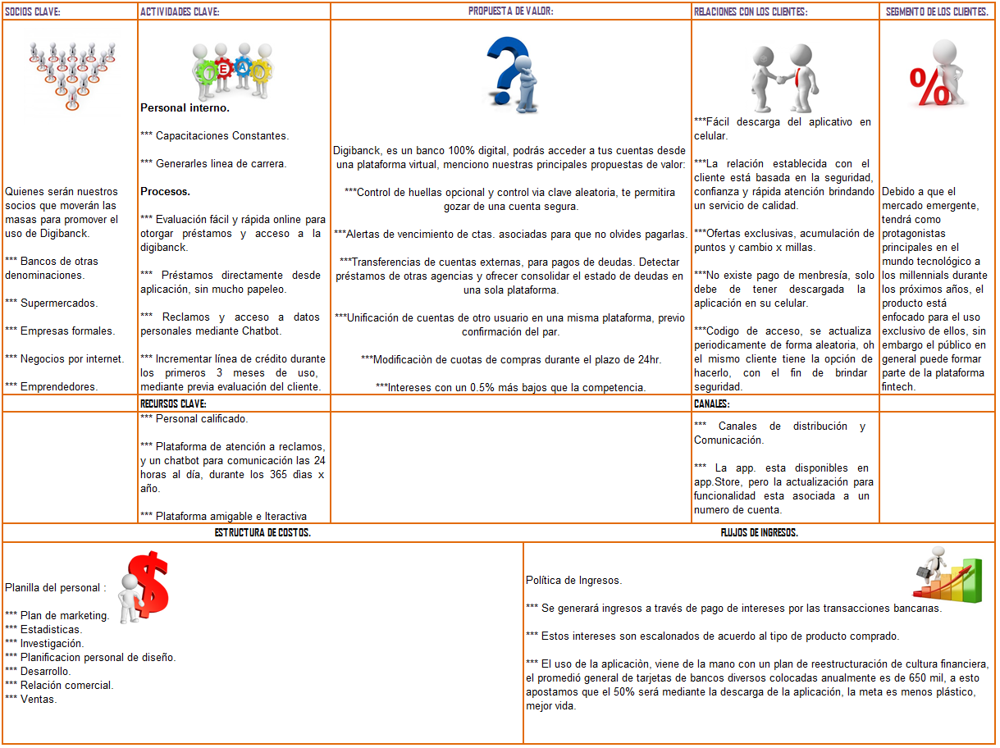
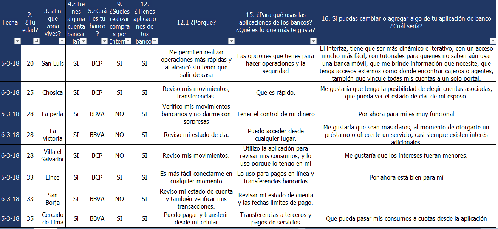
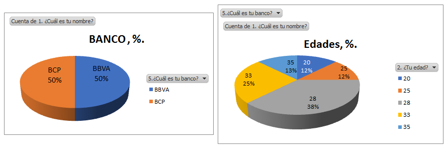
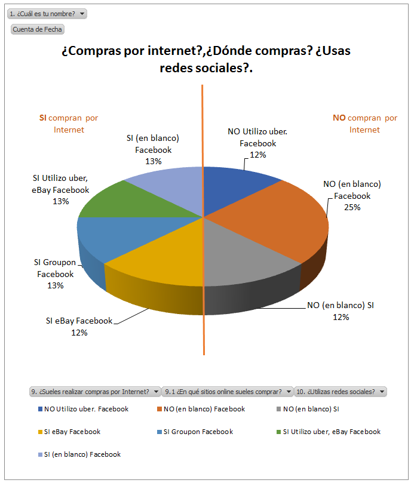
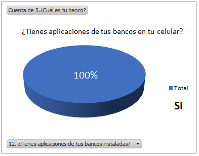
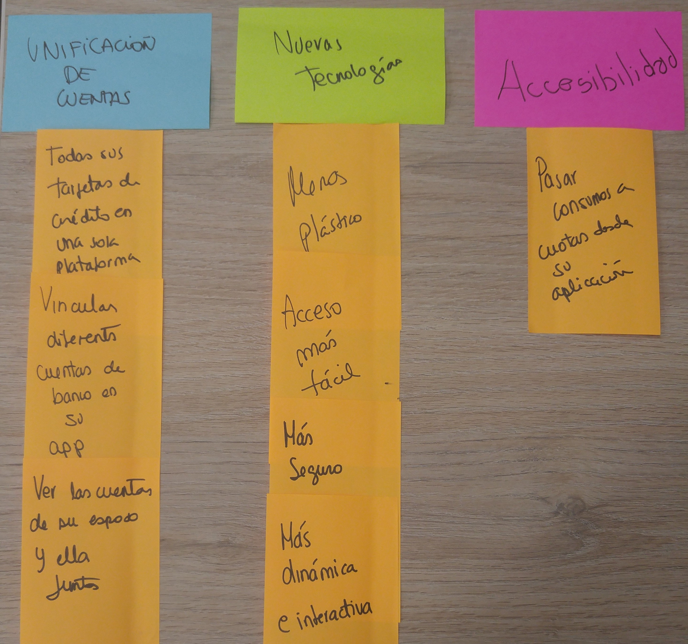
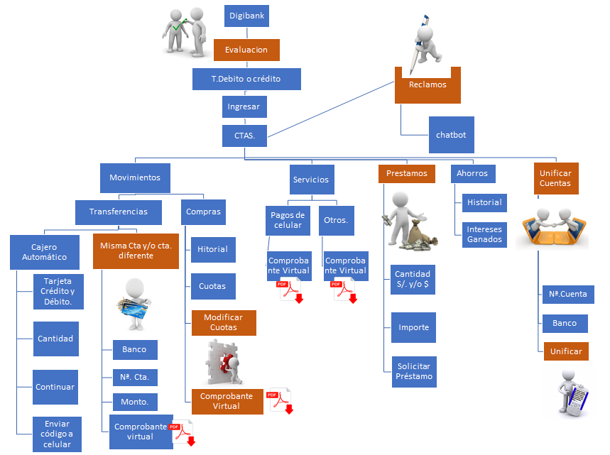
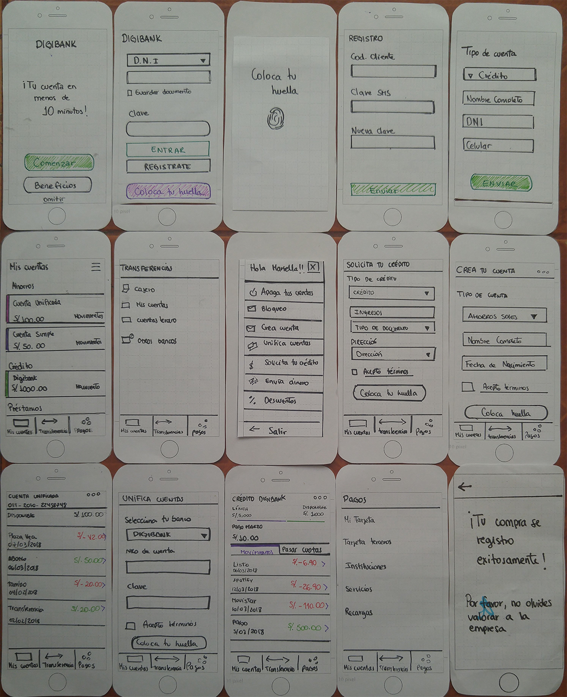

# DIGIBANK 

Digibank es una plataforma virtual bancaria que ayuda al usuario a realizar sus transacciones más importante mediante su smartphone.

## Desarrollado para
[Laboratoria](http://laboratoria.la)

## Descubrimiento e investigación

### Planeamiento

Presentación de Kick Off y conversaciones en el Squad para poder analizar cuáles serían las metodologías a usar para el reto asignado.

### STAKEHOLDERS

Para nuestro ux-research se ha decidido dividir nuestro grupo de interés de la siguiente manera: 

- Business
- Engineering
- UX people

### MODELO CANVAS.

##### 1. Business

En la parte de Business estarán las personas de la alta gerencia y marketing ya que nos ayudarán a que nuestra investigación vaya por el buen camino de los objetivos comerciales. Además, su apoyo me ayudará a garantizar que tenga el tiempo y los recursos necesarios para mi investigación.

- CEO (Director General)
- Gerente de Riesgos
- Gerente de Marketing
- Gerente de RR.HH

##### 2. Engineering

Los Engineers estarán conformados por los desarrolladores. Ellos me ayudarán a indicarme las limitaciones tecnológicas de mi proyecto.

- Gerente de TI
- Product Owner
- Arquitecto de Software
- Data scientist
- Data engenieer

##### 3. UX People

Los UX stakeholders son los otros researchers que trabajan en mi proyecto. Ellos me ayudarán a proporcionar más conocimiento a mi proyecto con diferentes ángulos sobre la experiencia de usuario.

- UX Researcher
- UX Designer

### RESEARCH

1. Conociendo a la persona : Se realiza preguntas abiertas para conocer cual es el perfil del usuario.
2. Conociendo el entorno: Preguntas para saber donde se desenvuelve nuestro usuario y sus circulos sociales.
3. Arquetipo de Persona: Según los resultados de las entrevistas.
4. Mapa de Empatía: Conocer que siente, piensa, hace y dice.
5. Paints points: Conocer los dolores más grandes que sufre en el día.

#### Guía de Entrevista

##### Objetivo

El ojetivo de la siguiente entrevista es conocer al millennials y su relación con los bancos, en específico centrarnos en la parte virtual.

##### Introducción

*Hola ¿Cómo estas? Soy ["nombre"]. En primer lugar quería agradecerte por tomarte el tiempo para conversar, trataré de no exterderme más de 30 minutos a lo mucho. Antes que nada, me gustaría preguntarte si estas de acuerdo con grabar la entrevista. Te aseguro que solo es para tema de investigación y no será publicada sin tu autorización. Tampoco existen preguntas mal contestadas, me gustaría simplemente que fueras lo más honesto posible ya que la finalidad de esto es poder mejorar. Si no hay ningún problema, comenzamos.*

##### Warming Up

**1- Me gustaría que me cuentes un poco sobre ti ¿Quién es Lorena y cómo es un día típico de ella?**

*Estamos atentos para llenar el screener validation*

###### Screener validation:
>Nombre :

>Edad :

>Zona en la que vive :

>Tiene alguna cuenta bancaria :

>Banco actual :

**2- ¿Qué es lo que sueles hacer los fines de semana o tiempos libres?**

*Estamos atentos a conocer el ecosistema del cliente.*

**3- Coméntame ¿Cómo te llevas con la tecnología? ¿Cómo es tu día a día?**

**4- ¿Sueles realizar compras por Internet? ¿En qué sitios online sueles comprar?**

*Comenzamos a indagar sobre qué dispositivo se conecta*

**5- ¿Qué es lo que tienen estos sitios online para que te den seguridad con respecto a las compras?**

**6- Y en las redes sociales ¿Eres una persona activa?**

##### Detailed Interview

**7- ¿Qué se te viene a la cabeza con la palabra banco?**

**8- ¿Cómo es tu relación con ellos? ¿Y por qué?**

*Ponemos atención sobre todo lo que nos pueda hablar*

**9- ¿Tienes aplicaciones de tus bancos instaladas? ¿Con qué propósito?**

**10- ¿Cuál es tu banco principal?**

**11- ¿Qué productos o servicios tienes en tu banco?**

**12- ¿Para qué usas las aplicaciones de los bancos? ¿Qué es lo que más te gusta?**

**13- Si puedas cambiar o agregar algo de tu aplicación de banco ¿Cuál sería?**

#### Entrevista con los millennials

### Lista de preguntas relevantes, de nuestra Investigación.

###### Camila Tume

#### Affinity MAP

#### User Flow

#### IDEACION

#### PROTOTIPO

